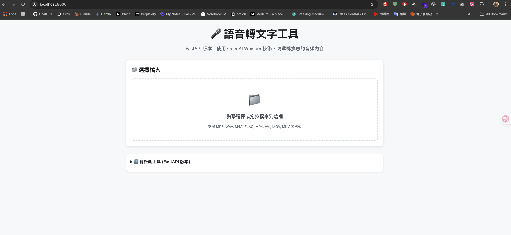

# 🎤 Whisper 語音轉文字工具

<div align="center">


基於 OpenAI Whisper 的網頁版語音轉文字應用程式
**🚀 現提供 FastAPI + 原生前端 和 Streamlit 兩種版本**



[功能特色](#-功能特色) • [快速開始](#-快速開始) • [使用方法](#-使用方法) • [技術支援](#-技術支援)

</div>

## 📋 目錄

- [功能特色](#-功能特色)
- [系統需求](#-系統需求)
- [快速開始](#-快速開始)
- [使用方法](#-使用方法)
- [支援格式](#-支援格式)
- [模型說明](#️-模型說明)
- [進階設定](#-進階設定)
- [故障排除](#-故障排除)
- [開發指南](#-開發指南)
- [貢獻指南](#-貢獻指南)
- [授權條款](#-授權條款)

## ✨ 功能特色

### 🌟 雙版本架構
- **FastAPI 版本** - 前後端分離，支援 API 調用，異步處理
- **Streamlit 版本** - 傳統整合式介面，快速啟動

### 🔧 核心功能
- 🌐 **網頁介面** - 現代化的瀏覽器介面，無需複雜安裝
- 🤖 **AI 驅動** - 使用 OpenAI Whisper 模型，準確度高
- 🎯 **多語言支援** - 支援中文、英文、日文、韓文等多種語言
- 📁 **多格式支援** - 支援音檔和影片檔案轉換
- ⚡ **智慧處理** - 大檔案自動切割，提升處理效率
- ⏰ **時間戳記** - 可選擇包含精確的時間戳記
- 📊 **即時進度** - 處理狀態和預估時間顯示
- 💾 **一鍵下載** - 轉換完成後立即下載結果
- 🎛️ **彈性設定** - 多種 AI 模型可選，平衡速度與準確度
- 📈 **處理統計** - 顯示字數、字元數和處理時間

### 🚀 FastAPI 版本專屬優勢
- 🔄 **異步處理** - 可同時處理多個請求
- 📖 **自動 API 文檔** - Swagger UI + ReDoc
- 🛡️ **類型安全** - Pydantic 模型驗證
- 🏗️ **前後端分離** - 更靈活的架構
- 🌐 **標準 Web 技術** - 易於部署和擴展

## 💻 系統需求

- **Python**: 3.8-3.12 或更高版本
- **記憶體**: 至少 4GB RAM（推薦 8GB）
- **磁碟空間**: 至少 5GB 可用空間（用於 AI 模型）
- **網路**: 首次使用需下載 AI 模型
- **依賴套件**: 自動安裝（見 requirements.txt）

## 🚀 快速開始

> **🎆 新功能**：現提供 FastAPI 和 Streamlit 兩種版本，可依需求選擇！

### 🎆 方法一：FastAPI 版本（🔥 新推薦）

**特色**：前後端分離、API 支援、異步處理、高效能

#### Windows 使用者
```bash
# 1. 下載專案
git clone https://github.com/vincentxuu/whisper-web-transcriber.git
cd whisper-web-transcriber

# 2. 啟動 FastAPI 版本
./scripts/start-fastapi.sh
```

#### macOS/Linux 使用者
```bash
# 1. 下載專案
git clone https://github.com/vincentxuu/whisper-web-transcriber.git
cd whisper-web-transcriber

# 2. 啟動 FastAPI 版本
./scripts/start-fastapi.sh
```

**完成後訪問**：
- **主要介面**: http://localhost:8000
- **API 文檔**: http://localhost:8000/docs

### 🌍 方法二：Streamlit 版本（經典版）

**特色**：簡單易用、快速啟動、適合個人使用

#### Windows 使用者
```bash
# 1. 下載專案（如上）

# 2. 啟動 Streamlit 版本
./scripts/start.bat
```

#### macOS/Linux 使用者
```bash
# 1. 下載專案（如上）

# 2. 啟動 Streamlit 版本
./scripts/start.sh
```

**完成後訪問**：http://localhost:8501

### 🛠️ 手動安裝方法

```bash
# 1. 安裝 Python 套件
pip install -r requirements.txt

# 2a. 啟動 FastAPI 版本
cd backend && python app.py

# 2b. 或啟動 Streamlit 版本
streamlit run whisper_app.py
```

## 📱 使用方法

### 基本使用流程

1. **選擇檔案**
   - 點擊上傳區域或拖拉檔案
   - 支援音檔和影片格式

2. **設定選項**
   - 選擇 AI 模型大小
   - 選擇音檔語言
   - 決定是否包含時間戳記

3. **開始轉換**
   - 點擊「開始轉換」按鈕
   - 等待處理完成

4. **下載結果**
   - 檢視轉換結果
   - 下載文字檔案

### 介面說明

| 區域 | 功能 |
|------|------|
| 📁 檔案上傳區 | 選擇要轉換的音檔/影片檔案 |
| ⚙️ 設定面板 | 選擇模型、語言和輸出選項 |
| 📊 狀態顯示 | 顯示處理進度和預估時間 |
| 📝 結果區域 | 查看和下載轉換結果 |
| 💡 提示面板 | 使用技巧和快速設定 |

## 🎯 支援格式

### 音檔格式
- **MP3** - 最常見的音檔格式
- **WAV** - 無損音檔格式
- **M4A** - Apple 音檔格式
- **FLAC** - 無損壓縮格式

### 影片格式
- **MP4** - 最常見的影片格式
- **AVI** - 傳統影片格式
- **MOV** - Apple 影片格式
- **MKV** - 開源影片容器
- **WebM** - 網頁影片格式

## 🛠️ 模型說明

| 模型 | 大小 | 速度 | 準確度 | 適用場景 |
|------|------|------|--------|----------|
| **Tiny** | ~39 MB | ⚡⚡⚡⚡⚡ | ⭐⭐ | 快速測試、即時轉換 |
| **Base** | ~74 MB | ⚡⚡⚡⚡ | ⭐⭐⭐ | 日常使用、平衡選擇 |
| **Small** | ~244 MB | ⚡⚡⚡ | ⭐⭐⭐⭐ | 較高品質需求 |
| **Medium** | ~769 MB | ⚡⚡ | ⭐⭐⭐⭐⭐ | 專業用途 |
| **Large** | ~1550 MB | ⚡ | ⭐⭐⭐⭐⭐ | 最高品質需求 |

### 模型選擇建議

- 🚀 **測試或展示**: 選擇 `Tiny`
- 📱 **日常使用**: 選擇 `Base`（推薦）
- 🎯 **重要會議**: 選擇 `Small` 或 `Medium`
- 👑 **專業轉錄**: 選擇 `Large`

## ⚙️ 進階設定

### 環境變數設定

```bash
# 設定模型下載路徑
export WHISPER_CACHE_DIR="/path/to/models"

# 設定 GPU 使用（如有 CUDA）
export CUDA_VISIBLE_DEVICES=0
```

### 自訂設定檔

建立 `config.yaml` 檔案（選用功能）：

```yaml
# 預設設定
default_model: "base"
default_language: "auto"
max_file_size: 1000  # MB

# 介面設定
theme: "light"
show_advanced_options: true
```

### 批次處理

```python
# 使用 Python 腳本進行批次處理
import whisper

model = whisper.load_model("base")
files = ["audio1.mp3", "audio2.wav", "audio3.m4a"]

for file in files:
    result = model.transcribe(file)
    with open(f"{file}_transcript.txt", "w", encoding="utf-8") as f:
        f.write(result["text"])
    print(f"處理 {file} 完成")
```

## 🔧 故障排除

### 常見問題

<details>
<summary><strong>Q: 安裝時出現權限錯誤</strong></summary>

**A:** 嘗試以下解決方案：

```bash
# Windows（以管理員身分執行）
pip install --user -r requirements.txt

# macOS/Linux
sudo pip install -r requirements.txt
# 或
pip install --user -r requirements.txt
```
</details>

<details>
<summary><strong>Q: 記憶體不足錯誤</strong></summary>

**A:** 
- 選擇較小的模型（Tiny 或 Base）
- 開啟「自動切割大檔案」選項
- 處理較小的檔案（< 100MB）
- 關閉其他占用記憶體的程式
</details>

<details>
<summary><strong>Q: 模型下載失敗</strong></summary>

**A:**
- 檢查網路連線
- 嘗試使用 VPN
- 手動下載模型檔案
- 設定代理伺服器

```bash
# 設定代理
export HTTP_PROXY=http://your-proxy:port
export HTTPS_PROXY=https://your-proxy:port
```
</details>

<details>
<summary><strong>Q: 轉換結果不準確</strong></summary>

**A:**
- 使用較大的模型（Medium 或 Large）
- 確保音檔品質良好
- 選擇正確的語言設定
- 減少背景噪音
- 確保說話清晰
</details>

<details>
<summary><strong>Q: 處理速度太慢</strong></summary>

**A:**
- 選擇較小的模型（Tiny 或 Base）
- 開啟自動切割功能
- 使用 GPU 加速（需要 CUDA）
- 處理較短的音檔片段
</details>

### 錯誤代碼對照

| 錯誤代碼 | 說明 | 解決方法 |
|----------|------|----------|
| `CUDA_ERROR` | GPU 相關錯誤 | 檢查 CUDA 安裝或使用 CPU 模式 |
| `MEMORY_ERROR` | 記憶體不足 | 選擇小模型或切割檔案 |
| `FORMAT_ERROR` | 檔案格式不支援 | 轉換為支援的格式 |
| `SIZE_ERROR` | 檔案過大 | 開啟自動切割或壓縮檔案 |

### 效能最佳化

```python
# 自訂處理參數
transcribe_options = {
    "temperature": 0.0,          # 降低隨機性
    "compression_ratio_threshold": 2.4,
    "logprob_threshold": -1.0,
    "no_speech_threshold": 0.6,
}
```

## 👨‍💻 開發指南

### 本地開發環境設定

```bash
# 1. clone專案
git clone https://github.com/vincentxuu/whisper-web-transcriber.git
cd whisper-web-transcriber

# 2. 建立虛擬環境
python -m venv venv
source venv/bin/activate  # Linux/macOS
# 或
venv\Scripts\activate     # Windows

# 3. 安裝依賴
pip install -r requirements.txt

# 4. 執行應用
streamlit run whisper_app.py

# 5. 啟動開發服務器
streamlit run whisper_app.py --server.runOnSave true
```

### 專案結構

```
whisper-web-transcriber/
├── backend/                    # FastAPI 後端
│   ├── app.py                 # FastAPI 主應用程式
│   ├── models/                # AI 模型服務
│   │   ├── __init__.py        
│   │   └── whisper_service.py 
│   ├── utils/                 # 工具函數
│   │   ├── __init__.py        
│   │   └── file_handler.py    
│   └── requirements.txt       # 後端依賴
├── frontend/                   # 原生前端
│   ├── index.html            # 主頁面
│   ├── css/
│   │   └── main.css          # 樣式檔
│   └── js/
│       └── app.js            # JavaScript 邏輯
├── whisper_app.py              # Streamlit 版本主程式
├── requirements.txt            # Streamlit 版本依賴
├── uploads/                    # 上傳檔案存放
├── results/                    # 轉換結果存放
├── logs/                       # 日誌檔案
├── scripts/                    # 腳本檔案
│   ├── install-fastapi.sh     # FastAPI 安裝腳本
│   ├── start-fastapi.sh       # FastAPI 啟動腳本
│   ├── install.bat            # Streamlit Windows 安裝
│   ├── install.sh             # Streamlit Unix 安裝
│   ├── start.bat              # Streamlit Windows 啟動
│   └── start.sh               # Streamlit Unix 啟動
├── LICENSE                     # 授權條款
├── README.md                   # 專案說明
├── set_permissions.sh          # 權限設定
└── venv/                       # Python 虛擬環境
```

### 程式碼風格

本專案遵循以下程式碼規範：

- **Python**: PEP 8
- **格式化工具**: Black
- **靜態分析**: Flake8
- **型別檢查**: MyPy

```bash
# 執行程式碼檢查
black whisper_app.py
flake8 whisper_app.py
mypy whisper_app.py
```

## 🤝 貢獻指南

我們歡迎任何形式的貢獻！

### 貢獻方式

1. **回報問題**
   - 使用 [Issues](https://github.com/vincentxuu/whisper-web-transcriber/issues) 回報 Bug
   - 提供詳細的錯誤資訊和重現步驟

2. **功能建議**
   - 在 Issues 中標記為 `enhancement`
   - 描述建議的功能和使用情境

3. **程式碼貢獻**
   - Fork 本專案
   - 建立功能分支：`git checkout -b feature/amazing-feature`
   - 提交變更：`git commit -m 'Add amazing feature'`
   - 推送分支：`git push origin feature/amazing-feature`
   - 建立 Pull Request

### 貢獻者

感謝所有為本專案做出貢獻的開發者：

<a href="https://github.com/vincentxuu/whisper-web-transcriber/graphs/contributors">
  
</a>

## 🚀 FastAPI API 文檔

### 主要 API 端點

| 端點 | 方法 | 描述 | 範例 |
|------|------|------|------|
| `/api/health` | GET | 健康檢查 | `curl http://localhost:8000/api/health` |
| `/api/models` | GET | 獲取可用模型列表 | 返回所有 Whisper 模型資訊 |
| `/api/upload` | POST | 上傳音頻檔案 | 支援多種音頻/視頻格式 |
| `/api/transcribe` | POST | 開始語音轉文字 | 異步處理，立即返回 |
| `/api/status/{file_id}` | GET | 查詢處理狀態 | 輪詢處理進度 |
| `/api/result/{file_id}` | GET | 獲取轉換結果 | 返回文字內容和統計 |
| `/api/download/{file_id}` | GET | 下載結果檔案 | 下載 .txt 檔案 |

### API 使用範例

#### 1. 上傳檔案
```bash
curl -X POST "http://localhost:8000/api/upload" \
  -H "Content-Type: multipart/form-data" \
  -F "file=@audio.mp3"
```

#### 2. 開始轉換
```bash
curl -X POST "http://localhost:8000/api/transcribe" \
  -H "Content-Type: application/json" \
  -d '{
    "file_id": "your-file-id",
    "model_size": "base",
    "language": "auto",
    "include_timestamps": false
  }'
```

#### 3. 查詢狀態
```bash
curl "http://localhost:8000/api/status/your-file-id"
```

#### 4. 獲取結果
```bash
curl "http://localhost:8000/api/result/your-file-id"
```

### 🌐 互動式 API 文檔

啟動 FastAPI 版本後，可訪問：
- **Swagger UI**: http://localhost:8000/docs
- **ReDoc**: http://localhost:8000/redoc

### 版本比較

| 功能 | FastAPI 版本 | Streamlit 版本 |
|------|-------------|----------------|
| **啟動方式** | `./scripts/start-fastapi.sh` | `./scripts/start.sh` |
| **訪問地址** | http://localhost:8000 | http://localhost:8501 |
| **API 支援** | ✅ 完整 REST API | ❌ 無 |
| **並發處理** | ✅ 異步多請求 | ❌ 單一請求 |
| **自動文檔** | ✅ Swagger + ReDoc | ❌ 無 |
| **前端技術** | 原生 HTML/CSS/JS | Streamlit 元件 |
| **部署難度** | 🟢 標準 Web 應用 | 🟡 需要 Streamlit |
| **擴展性** | 🟢 易於擴展 | 🟡 受框架限制 |
| **適用場景** | 生產環境、API 整合 | 快速原型、個人使用 |

## 📊 專案統計


## 📄 授權條款

本專案採用 MIT 授權條款 - 詳見 [LICENSE](LICENSE) 檔案

## 🙏 致謝

- [OpenAI Whisper](https://github.com/openai/whisper) - 強大的語音識別模型
- [Streamlit](https://streamlit.io/) - 優秀的 Python 網頁應用框架
- [PyDub](https://github.com/jiaaro/pydub) - 音檔處理函式庫

## 📞 聯絡方式

- 專案維護者：vincentxuu
- 專案首頁：[https://github.com/vincentxuu/whisper-web-transcriber](https://github.com/vincentxuu/whisper-web-transcriber)
- 問題回報：[Issues](https://github.com/vincentxuu/whisper-web-transcriber/issues)

---

<div align="center">

如果這個專案對你有幫助，請考慮給我們一個 ⭐

**[回到頂部](#-whisper-語音轉文字工具)**

**專案路徑：** [vincentxuu/whisper-web-transcriber](https://github.com/vincentxuu/whisper-web-transcriber)

</div>
